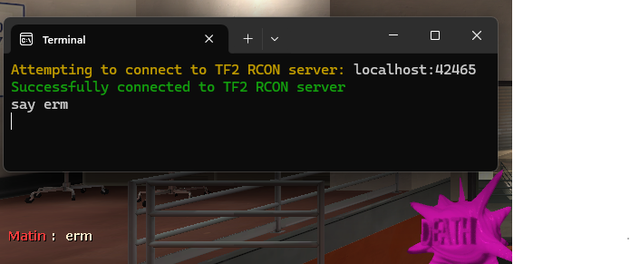

# TF2 RCON

An example Rust application connecting to the local TF2 RCON server and executing commands to the game console through the terminal.

## Setup

1. Set TF2 launch options

`-usercon +ip 0.0.0.0 +rcon_password password +hostport 42465 +net_start`

> [!WARNING]  
> You may want to use a different RCON password, as any application running on your machine will be able to access it.

2. Build and Run

`cargo run --release`

3. Execute commands from the terminal

